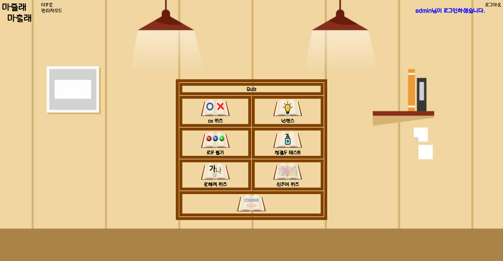
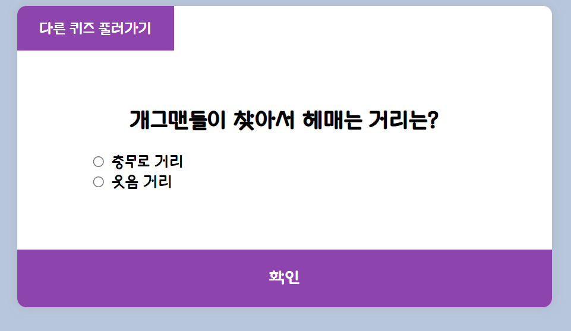

## 목차
- [목차](#목차)
- [프로젝트 개요](#프로젝트-개요)
- [주요 기능](#주요-기능)
- [프로젝트 목표](#프로젝트-목표)
- [기술 스택](#기술-스택)
  - [Java](#java)
  - [Tomcat](#tomcat)
  - [JavaScript](#javascript)
  - [oracleDB](#oracledb)
- [프로젝트 결론](#프로젝트-결론)
- [프로젝트 문제점](#프로젝트-문제점)

<br>
<br>

## 프로젝트 개요
퀴즈 웹 사이트 마즐래 마출래는 사용자가 퀴즈를 풀고 맞출 수 있는 웹페이지를 제공해주기 위해 구현하였습니다.

## 주요 기능
- 사용자가 회원가입, 로그인을 진행하여 다양한 퀴즈를 풀 수 있는 기능
- 사용자가 자신의 정보를 보고 수정 할 수 있는 기능
- admin 모드를 만들어서 admin 관리자가 회원들을 관리할 수 있는 기능

## 프로젝트 목표
개인 프로젝트로 java, jsp, JavaScript, html, CSS언어로 웹페이지 제작 경험을 쌓기 위해 진행 하였으며 사용자가 웹 사이트를 이용하여 회원 관리, 로그인을 시도하고 다양한 퀴즈를 풀 수 있게끔 제공하는 것이 목표입니다.

## 기술 스택


<br>
<br>
<br>

***
### Java
jsp 문법을 사용하고 자바 언어를 사용하여 웹 페이지에서 회원가입, 로그인, 정보 조회, 수정, 삭제 등의 기능을 구현하였습니다. 

<br>

- DB 연동 및 값 불러오기
```jsp
<%
   String id = null;
   request.setCharacterEncoding("euc-kr");
 
   String info_id = request.getParameter("id"); //id를 받아옴
 
   Connection conn = null;
   PreparedStatement stmt = null;
   ResultSet rs = null;
 
   try { //데이터 베이스에 연결
      Context init = new InitialContext();
      DataSource ds = (DataSource) init.lookup("java:comp/env/jdbc/OracleDB");
      conn = ds.getConnection();
 
      String sql = "select * from info where id=?"; //id에 대한 정보를 모두 출력
      stmt = conn.prepareStatement(sql); //sql문 출력
      stmt.setString(1, info_id);
      rs = stmt.executeQuery();
      rs.next();
 
   } catch (Exception e) {
      e.printStackTrace();
   }
%>
``` 

- 불러온 값 웹 페이지에서 보여주기
```jsp
<body>
	<div class="header">
		<div class="title"><a href="quiz_info.jsp">마즐래<br>&nbsp;&nbsp;마출래</a></div>
		<div class="rank"><%=rs.getString("name") %></div>
	</div>

	<div class="option user_info">
			<h2 class="option info_h2">user_info</h2>
			<dl class="option info_border">
				<dt class="option info_dt">
					<label>아이디</label>
				</dt>
				<dd class="option info_dd">
					<p><%=rs.getString("id")%></p>
				</dd>
				<dt class="option info_dt">
					<label>비밀번호</label>
				</dt>
				<dd class="option info_dd">
					<p><%=rs.getString("pass")%></p>
				</dd>
				<dt class="option info_dt">
					<label>이메일</label>
				</dt>
				<dd class="option info_dd">
					<p><%=rs.getString("mail")%></p>
				</dd>
				<dt class="option info_dt">
					<label>주민등록번호</label>
				</dt>
				<dd class="option info_dd">
					<p><%=rs.getString("pnum")%> - <%=rs.getString("nnum")%></p>
				</dd>
				<dt class="option info_dt">
					<label>생일</label>
				</dt>
				<dd class="option info_dd">
					<p><%=rs.getString("year")%>년 <%=rs.getString("mon")%>월 <%=rs.getString("day")%>일</p>
				</dd>
			</dl>
		</div>
</body>
```

<br>

### Tomcat
서블릿과 JSP를 실행 할 수 있는 서블릿 컨테이너 톰캣으로 웹 서버를 구축하였습니다.  
Tomcat 버전은 9.0으로 진행하였습니다.

<br>

### JavaScript
자바 스크립트 언어로 퀴즈를 진행할때 퀴즈내의 정답 체크, 점수 체크 기능을 구현하였습니다.

```javascript
const quizData = [
    {
        question : "Q1.나는 마스크를 착용하지 않거나 코, 턱에 걸친다.",
        a : "YES",
        b : "NO",
        correct : "b"
    },
    {
        question : "Q2.친구들과 함께 클럽, 헌팅포차 방문을 즐긴다.",
        a : "YES",
        b : "NO",
        correct : "b"
    },
];

const questionEl = document.getElementById("question")
const a_textEl = document.getElementById("a_text");
const b_textEl = document.getElementById("b_text");
const quiz = document.getElementById("quiz")
const button = document.getElementById("submit")
const resultDisplay = document.getElementById('result');

const answersEls = document.querySelectorAll('.answer')

let cur = 0;
let score = 0;


function loadQuiz(){ //퀴즈를 불러오는 함수
    questionEl.innerText = quizData[cur].question
    a_textEl.innerText = quizData[cur].a
    b_textEl.innerText = quizData[cur].b
}


function getSelected(){ //내가 고른 답을 불러오는 함수
    let selected = undefined;
    answersEls.forEach(ele => {
        if(ele.checked){
            selected = ele.id
        }
    })
    return selected;
}

//다음 문제로 넘어갈때 답체크 해제
function deSelectAnswer(){
    answersEls.forEach(element => {
        element.checked = false
    });
}


button.addEventListener('click', () => {
	//내가 고른 답이 정답일때 점수증가
    if(getSelected() === quizData[cur].correct){
        score ++;
    }
    cur++; //버튼 눌렀을때 다음문제로

    if (cur >= quizData.length ){ 
	
        resultDisplay.innerHTML = `${score}0% 청결함.`;
    }else{  //아니라면 퀴즈 계속 진행, 답체크 해제
        loadQuiz();
        deSelectAnswer();
    }
});


loadQuiz();
```

<br>

### oracleDB
JDBC 드라이버로 oracleDB와 연동하였고 회원의 정보를 저장하는 info table을 생성하여 회원들의 정보를 저장하였습니다.

- 회원 정보 생성 sql
```sql
create table info(
        ID varchar2(12) primary key,
        pass VARCHAR2(12),
        mail varchar2(50),
        name varchar2(20),
        pnum varchar2(6),
        nnum varchar2(7),
        year varchar2(4),
        mon varchar2(2),
        day varchar2(2)
);

```

## 프로젝트 결론
- 관리자 모드로 로그인 한 화면

- 퀴즈 화면


회원가입, 로그인, 정보 검색, 수정, 삭제 기능이 모두 원활 하게 구현 되었고 퀴즈를 풀 수 있는 기능도 정상적으로 동작하였습니다. 또 admin 모드로 접속하여 다른 회원들의 정보를 삭제할 수 있는 기능도 정상적으로 동작하였습니다.

## 프로젝트 문제점
- 해당 프로젝트를 진행하며 eclipse와 oracleDB 연동 관련된 부분이 잘 이루어지지 않는 문제가 있어 개발하는데 어려움을 겪었었습니다. 이러한 문제를 구글링을 통해 oracleDB와의 연동 문제를 해결할 수 있었고 eclipse와 oracleDB의 연동 방법을 더욱 명확하게 알게 되었습니다.  
- 웹 서비스의 기능이 단순이 퀴즈만 푸는 것 뿐이여서 차후에 퀴즈를 풀고 회원 별 점수를 저장 하고 랭킹 시스템을 도입하려고 합니다.